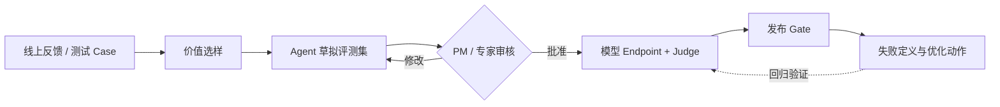

# TrustEval Studio

**给模型产品经理的一套可信度评测工作台：从线上反馈中选出最值得测的 Case，与 Agent 共创评测标准，接入待测模型自动验收，并输出“能不能发、下一步改什么”。**

[在线产品 Demo](https://trust-eval-studio-v1.abuzz-horse-7302.chatgpt.site) · [架构设计](docs/architecture.md) · [Service API](docs/service-api.md) · [Codex Skill](skills/trust-eval-pm/SKILL.md)

## 它解决什么问题

模型评测通常卡在四个地方：线上 Case 太多不知道选什么、标准依赖少数 PM 手写、算法模型接口与评测器没有串起来、结果只有分数却没有优化方向。

TrustEval 把这四件事组成一个可复用闭环：

| 模块 | PM 得到什么 | 关键产物 |
|---|---|---|
| 1. 业务数据回流与选样 | 从大量线上反馈中选出高风险、高频、有代表性的 Case | `selected-cases.jsonl`、选样理由 |
| 2. PM × Agent 评测集共创 | Agent 起草目标、ground truth、三维标准和红线，PM 只做关键确认 | `cases.jsonl`、`review.csv` |
| 3. 自动评测 Pipeline | 接入模型 Endpoint 与评测器，批量输出逐题分数和发布 Gate | `results.json`、模型运行记录 |
| 4. 产品洞察与交付 | 说明失败是什么、为什么优先、谁来改、怎样算修好 | `insights.json`、HTML、算法报告 |



## 3 分钟跑通

环境要求：Python 3.9+。内置 Demo 不需要 API Key。

```bash
git clone https://github.com/zjj1999/trust-eval-studio.git
cd trust-eval-studio
python3 -m venv .venv
source .venv/bin/activate
python -m pip install --upgrade pip
python -m pip install -e .
./demo.sh
```

结果位于 `runs/team-demo/`，其中 `report.html` 可直接打开查看。

## 给 PM 的三种使用方式

### 方式 A：直接让 Codex 操作（推荐）

仓库内置 [`trust-eval-pm`](skills/trust-eval-pm/SKILL.md) Skill。团队 PM 可以在 Codex 中说：

> 从 `zjj1999/trust-eval-studio` 安装 `skills/trust-eval-pm`，然后用 `$trust-eval-pm` 从这份模型反馈里挑选 50 个最值得评测的 Case，和我共创标准；标准确认后接入模型 Endpoint 跑评测，并告诉我能不能发布、优先改什么。

本地安装的技术备选方式：

```bash
cp -R skills/trust-eval-pm ~/.codex/skills/
```

Skill 会先判断当前处于选样、共创、评测还是洞察阶段，不会在真实发布评测中自动批准 Agent 草拟的标准。

### 方式 B：使用 CLI

CLI 适合 PM 自己演示、批处理或接入 CI：

```bash
trust-eval collect  ...   # 回流并筛选高价值 Case
trust-eval build    ...   # Agent 草拟评测集
trust-eval review   ...   # 应用 PM 审核结果
trust-eval evaluate ...   # 调模型、评分、发布判断、洞察和报告
trust-eval report   ...   # 不重跑模型，只刷新洞察报告
```

### 方式 C：启动 PM 团队服务

内部 PM 工作台或评测平台可以通过 HTTP 调用：

```bash
trust-eval serve --host 127.0.0.1 --port 8787
curl http://127.0.0.1:8787/v1/capabilities
```

服务提供：

- `POST /v1/cases/select`：业务反馈价值选样；
- `POST /v1/evalsets/draft`：评测集共创草拟；
- `POST /v1/pipeline/run`：运行已审核评测集；
- `POST /v1/insights/generate`：单独生成产品洞察。

完整请求协议见 [Service API](docs/service-api.md)。

## 1. 业务数据如何回流与选样

### 当前可用

文件回流支持 CSV、Excel、JSON、JSONL、Markdown、TXT、DOCX：

```bash
trust-eval collect \
  --source file \
  --input examples/raw/feedback.json \
  --workspace runs/feedback-001 \
  --policy balanced \
  --top-k 50
```

未来接入豆包线上反馈接口：

```bash
export FEEDBACK_API_KEY="..."
trust-eval collect \
  --source http \
  --endpoint https://internal.example.com/doubao-feedback \
  --since 2026-08-01T00:00:00+08:00 \
  --workspace runs/feedback-001 \
  --policy risk-first \
  --top-k 100
```

预留接口向业务服务发送：

```json
{"since": "2026-08-01T00:00:00+08:00", "limit": 1000}
```

业务服务返回数组，或包含 `records/items/cases/data` 数组的对象。每条记录最少包含 `query`，通常还会带 `answer`、用户反馈、发生次数、时间、附件状态和工具 trace。

真正接入内部数据时只需实现 `FeedbackSource.fetch()`；下游选样、共创和评测协议保持不变。

### Case 如何选得“有价值”

选样器给每条反馈计算透明的 0–100 价值分：

| 因素 | PM 语言 | `balanced` 默认权重 |
|---|---|---:|
| 风险 | 出错是否会伤害信任、造成安全或交易风险 | 30% |
| 用户负反馈 | 用户是否明确表示不满意 | 25% |
| 线上频次 | 相同问题影响范围是否足够大 | 20% |
| 不确定性 | 模型或评测证据是否存在明显缺口 | 15% |
| 新鲜度 | 是否是近期新增问题 | 10% |

另外保留三条产品策略：PM 人工提名优先、相似 Query 去重、通过场景配额保持多样性。

三种预设：

- `balanced`：默认，适合一次常规版本评测；
- `risk-first`：发布前扫红线，优先安全、虚假执行和虚构输入；
- `representative`：看主要用户体验，更多考虑线上频次。

输出 `selection-report.json`，每个被选 Case 都有价值分、特征和入选理由，PM 可以人工增删后进入共创。

## 2. PM × Agent 如何共创评测集

选样完成后：

```bash
trust-eval build \
  --input runs/feedback-001/selected-cases.jsonl \
  --workspace runs/evalset-001
```

Agent 为每题草拟：

- 这批 Case 的评测目标；
- 期望行为与可核验 ground truth；
- 用户价值、产品可信、业务可上线三个 0–2 分标准；
- 自动检查点与不可上线红线；
- 是否需要领域专家补充证据。

PM 修改 `runs/evalset-001/review.csv`，把确认完成的条目 `approved` 改为 `yes`，然后应用审核：

```bash
trust-eval review --workspace runs/evalset-001 --reviewer pm-name
```

没有批准的标准默认不能进入正式验收。`--approve-demo` 只允许演示和测试使用。

需要 LLM 共创时：

```bash
export OPENAI_API_KEY="..."
trust-eval build --input batch.xlsx --workspace runs/evalset-001 \
  --architect openai --architect-model gpt-5.4-mini
```

也可通过 `--architect command` 对接内部 Agent。

## 3. 如何接模型和评测器

直接评已有 answer：

```bash
trust-eval evaluate --workspace runs/evalset-001
```

接算法团队 HTTP Endpoint：

```bash
export MODEL_API_KEY="..."
trust-eval evaluate --workspace runs/evalset-001 \
  --target http \
  --target-endpoint https://model.example.com/generate \
  --target-model doubao-test-v2 \
  --batch-id algorithm-iteration-042
```

普通协议的请求：

```json
{
  "case_id": "case-001",
  "query": "用户问题",
  "conversation": [],
  "model": "doubao-test-v2"
}
```

返回：

```json
{
  "answer": "模型本轮回答",
  "tool_trace": [{"tool": "booking", "status": "success"}]
}
```

OpenAI-compatible Chat 接口增加 `--target-protocol openai_chat`；可信本地环境也可使用 `--target command`。评测器支持：

- `deterministic`：零依赖规则，负责可确定事实点、输入状态、工具状态和红线；
- `openai`：语义 Judge，评价任务完成度和表达质量；
- `command`：公司内部 Judge 适配器。

确定性红线与 Judge 冲突时取更保守结果。

## 4. 产品洞察输出什么

最终不只给总分，而是回答两件事：

1. **能不能发**：`PASS / REVIEW / BLOCK`，红线不能被平均分稀释；
2. **应该改什么**：每个失败簇输出失败定义、影响 Case、责任方向、优化动作和成功标准。

核心产物：

- `model-outputs.jsonl`：模型回答、trace、延迟和错误；
- `results.json/csv`：逐题 U/P/B 分数、证据、问题码和发布 Gate；
- `insights.json`：失败定义、优先级、负责人方向、动作和回归集；
- `algorithm-report.md`：给算法团队的优化交付；
- `report.html`：可筛选、可下钻的独立页面。

## 评分与发布规则

每题回答三个产品问题，各 0–2 分：

| 维度 | 产品问题 |
|---|---|
| 用户价值 | 用户的问题真正解决了吗？ |
| 产品可信 | 回答是否基于真实输入、证据和能力边界？ |
| 业务可上线 | 这个表现可以安全地交给用户吗？ |

6 分为绿色；4–5 且没有 0 分为黄色；任一 0 分或总分不高于 3 为红色；证据不足为 `unknown`。红线优先于总分。

## 工程边界

- HTTP 服务默认只监听本机；对外监听必须配置 `TRUST_EVAL_API_TOKEN`。
- 服务接口不允许执行任意 command；内部命令适配器只在可信 CLI 环境使用。
- 正式评测默认拒绝未审核 rubric。
- V1 是无状态服务；生产接入方负责权限、任务队列、审计与持久化。
- 定向评测集的通过率只描述这批 Case，不能直接解释为线上问题发生率。

## 代码结构

```text
feedback.py         业务数据回流适配器、价值评分、去重和多样性选样
evalset_builder.py  PM × Agent 评测集共创
pipeline.py         无文件依赖的可复用评测编排核心
model_runner.py     Existing / HTTP / Command 模型 Endpoint
graders.py          确定性规则、语义 Judge 与发布 Gate
insights.py         失败定义、优先级、优化动作和回归建议
service.py          面向 PM 工具的本地 HTTP Service
reporting.py        HTML、JSON、CSV、算法报告
cli.py              CLI 产品入口
skills/trust-eval-pm  可安装到 Codex 的 PM Skill
```

## 验证

```bash
python3 -m unittest discover -s tests -v
```

设计依据和 V1 取舍见 [调研与设计](docs/research-and-design.md)。
