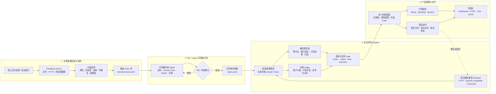

# TrustEval 产品架构：从线上反馈到模型优化闭环

四个模块通过同一份 Case 协议衔接。CLI 适合个人与自动化任务；本地 HTTP Service 适合内部 PM 工作台；Codex Skill 负责理解 PM 意图并调用对应模块。

## 四个模块的产品定义

### 1. 业务数据回流与价值选样

通过 `FeedbackSource` 预留线上数据接口。V1 支持文件和通用 HTTP；接入真实豆包回流时只需实现 `fetch()`。选样器按风险、负反馈、线上频次、不确定性和新鲜度计算透明价值分，并通过人工提名、去重和场景配额保留最值得评测的代表 Case。

输出：`feedback-inbox.jsonl`、`selected-cases.jsonl`、`selection-report.json`。

### 2. PM × Agent 评测集共创

输入可以只有 question 和已有 answer。模块先统一格式、理解整批 Case 想验证什么，再为每题起草 expected behavior、ground truth、检查点、三视角评分标准和上线红线。PM 不负责从零写标准，只确认 Agent 草稿和必须由专家核验的事实。

输出：`dataset-profile.json`、`cases.jsonl`、`review.csv`。

### 3. 自动评测 Pipeline

算法团队只提供一个待测模型 Endpoint。Runner 将评测集逐题发送给模型，保存 answer、延迟和工具 trace，再用确定性规则与语义 Judge 评分。规则负责可确定红线，Judge 负责语义质量；冲突时取保守结果。

输出：`model-outputs.jsonl`、逐题 U/P/B 分数、问题码、证据和发布 Gate。

### 4. 产品洞察与交付

把逐题结果转成产品和算法可行动的结论：本批能否发布、失败到底是什么、为什么优先、应由哪个方向负责、如何修改、怎样算修好，以及下一轮回归哪些 Case。

输出：`insights.json`、`results.json/csv`、`algorithm-report.md`、`report.html` 和 Web 工作台。

## 核心人机分工

- Agent 做规模化工作：价值选样、清洗、归一化、标准草拟、批量调用、评分、聚类和报告。
- PM 做高价值判断：评测目标、业务红线、上线门槛和争议 Case。
- 领域专家只处理必须核验的事实或高风险标准。
- 算法团队只需维护模型 Endpoint，并消费问题码、代表 Case 和回归清单。
